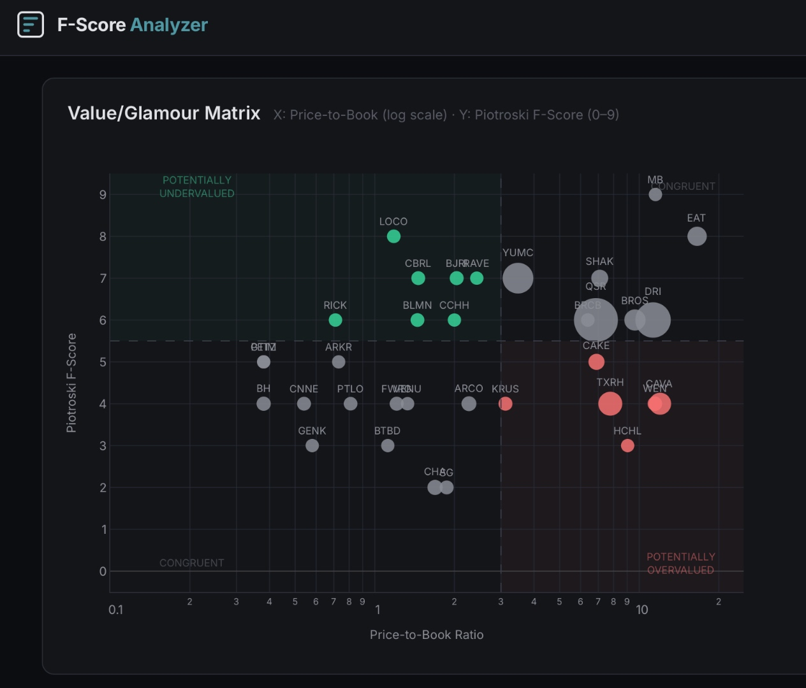

# F-Score Analyzer

A web application for evaluating publicly traded companies using the **Piotroski F-Score** and **Price-to-Book (P/B)** ratio framework from Piotroski & So (2012). The tool classifies companies into four quadrants (Value/Glamour × Strong/Weak) to identify potential expectation errors — stocks the market may have mispriced.



## Features

- Analyze up to **50 companies** at a time by entering ticker symbols
- Computes all **9 Piotroski F-Score signals** from live financial data (Yahoo Finance)
- Interactive **Value/Glamour Matrix** scatter plot (log-scale P/B vs. F-Score)
- Color-coded quadrant classification (green = BUY candidates, red = SHORT candidates)
- Bubble sizes proportional to market capitalization
- Detailed data table with filtering by quadrant
- CSV export of results

## Quick Start

### Prerequisites

- **Python 3.10+** installed
- Internet connection (for Yahoo Finance data)

### Installation

```bash
# 1. Unzip the project
unzip fscore-analyzer.zip
cd fscore-analyzer

# 2. Create a virtual environment (recommended)
python -m venv venv
source venv/bin/activate        # macOS/Linux
# venv\Scripts\activate          # Windows

# 3. Install dependencies
pip install -r requirements.txt
```

### Run

```bash
python api_server.py
```

Open your browser and go to: **http://localhost:8000**

That's it. The backend serves both the API and the frontend from a single process.

### Usage

1. Enter ticker symbols separated by commas (e.g., `AAPL, MSFT, GOOG`) or paste a list
2. Click **Analyze**
3. Wait for data to load (Yahoo Finance lookups take ~1–2 seconds per company)
4. Explore the scatter plot and data table
5. Filter by quadrant using the buttons above the table

## Methodology

The system implements the framework from:

> **Piotroski, J. D. & So, E. C. (2012).** *Identifying Expectation Errors in Value/Glamour Strategies: A Fundamental Analysis Approach.* Review of Financial Studies, 25(9), 2841–2875. [DOI: 10.1093/rfs/hhs065](https://doi.org/10.1093/rfs/hhs065)

### F-Score Signals (9 binary indicators)

| # | Signal | Category | Scores 1 if... |
|---|--------|----------|----------------|
| 1 | ROA > 0 | Profitability | Net Income / Total Assets > 0 |
| 2 | CFO > 0 | Profitability | Operating Cash Flow > 0 |
| 3 | ΔROA | Profitability | ROA improved year-over-year |
| 4 | Accruals | Profitability | CFO > Net Income (cash quality) |
| 5 | ΔLeverage | Leverage | Long-term debt / assets decreased |
| 6 | ΔLiquidity | Leverage | Current ratio improved |
| 7 | No Dilution | Leverage | Shares outstanding did not increase |
| 8 | ΔGross Margin | Efficiency | Gross margin improved |
| 9 | ΔAsset Turnover | Efficiency | Revenue / assets improved |

### Quadrant Classification

| | P/B < 3.0 (Value) | P/B ≥ 3.0 (Glamour) |
|---|---|---|
| **F-Score ≥ 6 (Strong)** | **BUY** — Potentially undervalued | Congruent (fairly priced) |
| **F-Score ≤ 4 (Weak)** | Congruent (fairly priced) | **SHORT** — Potentially overvalued |

## Data Source

All financial data is retrieved from **Yahoo Finance** via the [yfinance](https://github.com/ranaroussi/yfinance) Python library. Data is cached for 24 hours to minimize API calls.

## Tech Stack

- **Backend:** Python, FastAPI, yfinance, pandas
- **Frontend:** Vanilla HTML/CSS/JavaScript (no build step)
- **Charts:** Custom canvas-based scatter plot

## License

This project was built for educational purposes (MIT Sloan — Alphanomics course). Use at your own discretion.
